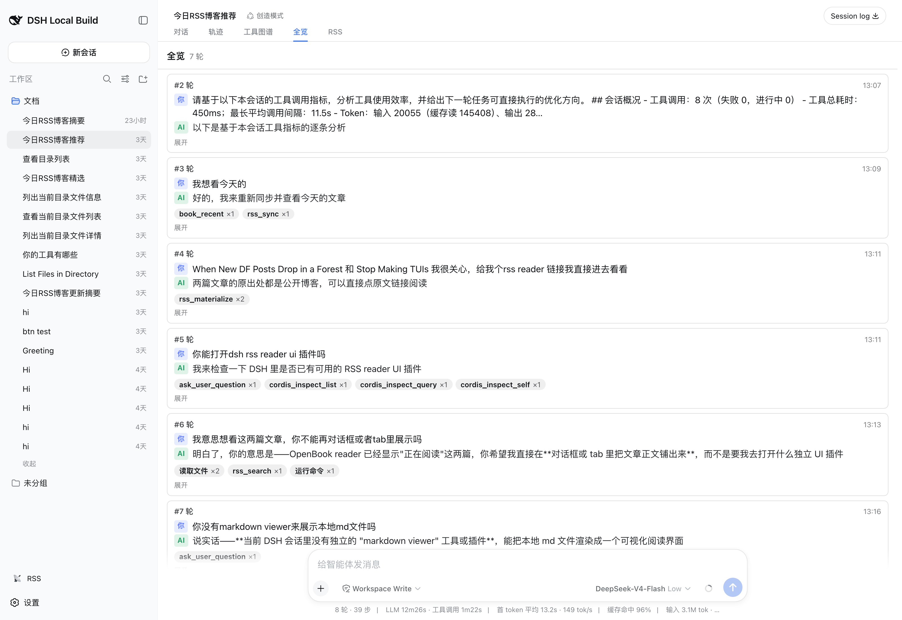
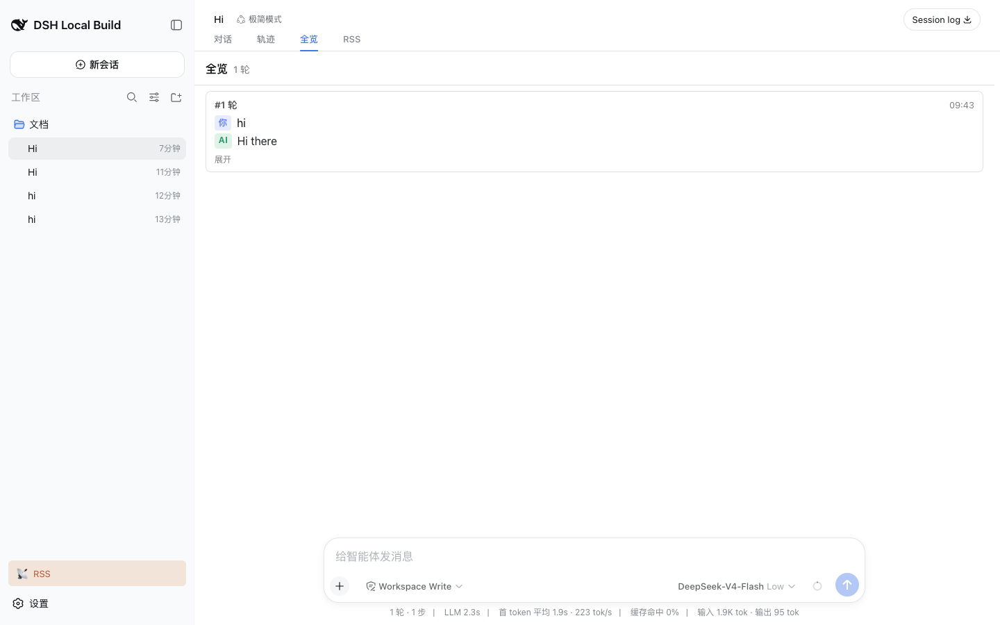

# dsh-ui-digest

为 [DeepSeek Harness](https://github.com/deepseek-ai/deepseek-harness)（dsh）Web UI 提供的**回合摘要全览**标签页插件。

AI 的回复动辄几百行（文本、工具卡片、diff、推理过程），把你真正问过的话和 AI 每轮做过的事淹没在长流里。这个插件在会话视图环中新增 **全览（Overview）** 标签页，把整个会话折叠成"每一条用户消息一轮"：

- **你发送的消息**原文
- AI 回复的**一句话总结**（取结定文本第一句，最多 160 字，自动截断）
- **工具行动徽标**：按类别统计（运行命令 / 修改文件 / 读取文件 / 检索网页 / 委派子代理等），并自动从编辑/写入类参数中提取文件路径

点击任意一行可展开完整消息与完整回复。摘要为启发式、确定性、纯客户端——不调用 LLM、不发 RPC、零成本，流式期间实时更新。



## 特性

- **每轮一行**——用户消息、一句话总结、行动徽标，可展开。
- **整会话总览**——覆盖已加载的历史窗口，支持"加载更早的对话"翻页。
- **实时**——运行中的一轮显示为"等待回复"，随分块落地自动结定。
- **零成本**——启发式摘要，纯函数折叠会话快照；无 LLM、无持久化、无事件族。
- **中英双语**——走 dsh 标准 locale 机制。
- **只读投影**——无服务、无 Context 合并、无会话节点定义，完全仿照官方 `ui-trajectory` 纯消费者模式。



## 安装

### 作为 dsh bundle（推荐）

本包附带预构建的客户端产物（`lib/`），并声明了 `dsh.bundle` + `dsh.client`，可直接用插件 CLI 安装。从[最新 Release](https://github.com/rocklau/dsh-ui-digest/releases) 获取 tarball 后执行（无需 npm 账号）：

```sh
dsh plugin add https://github.com/rocklau/dsh-ui-digest/releases/download/v0.1.0/dsh-ui-digest-0.1.0.tgz
```

这会向你的 profile 组合注入 `ui-digest` 行，浏览器端插件从 `lib/client.js` 提供。本地检出同样适用：`dsh plugin add ./dsh-ui-digest`。

### 接入 deepseek-harness 源码

1. 复制插件包：`cp -R <本仓库> <dsh根目录>/packages/client/ui-digest/`
2. 在 Web 组合中注册（共 3 处改动）：
   - `tsconfig.client.json` → `references` 增加 `{ "path": "./packages/client/ui-digest" }`
   - `packages/bundle/web-app/package.json` → 增加 `"@deepseek-ai/dsh-client-ui-digest": "workspace:^"` 依赖
   - `packages/bundle/web-app/cordis.patch.yml` → 花名册增加 `- id: ui-digest / name: @deepseek-ai/dsh-client-ui-digest`
3. `pnpm install && pnpm run build && pnpm dsh web`

需要 Node 22.19+ / 24 与 pnpm 11（与 harness 工具链一致）。本仓库 `lib/` 产物由 harness 自带的 tsdown 管线构建；如需重构建，在 harness 源码内执行 `pnpm run build:lib:client`。

## 工作原理

插件是纯消费者浏览器插件（完全对齐官方 `ui-trajectory` 形态）：

- 在 `conversation.view` 槽位环注册一个标签页（order 20）
- 通过框架标准套件的 `useSession` 折叠 `snapshot.chat.nodes`，按用户消息分轮
- 一轮从 append 表面的 `user`/`steering` 节点开始；AI 证据包括 `assistant-step` 结定文本、已结定 `tool-call` 根、或 `turn-tail` closing
- 摘要 = `firstSentence(回复文本, 160)`，无文本时使用结构化回退（"仅执行了工具调用"/"本轮无文本回复"/"回复生成中"）

工具分类：

| 类别 | dsh 工具 |
|---|---|
| shell · 运行命令 | `bash`、`pwsh`、`terminal` |
| read · 读取文件 | `read`、`read_image` |
| edit · 修改文件 | `edit`、`write`、`str_replace_editor` |
| search · 搜索文件 | `glob`、`grep` |
| web · 检索网页 | `web_search`、`web_fetch` |
| subagent · 委派子代理 | `subagent*` |
| todo / skill / goal / plan | `todo*`、`skill*`、`goal*`、`plan*` |

未知工具回退到原始工具名。文件路径从编辑/写入类参数的 `path`/`filePath`/`oldPath`/`newPath`/`uri`/`root`/`file` 键提取（去重，每类最多 8 个）。

## 已知限制

- **以窗口为界**——摘要覆盖已加载的历史窗口；用"加载更早的对话"翻页。被压缩（compaction）的会话只显示压缩后表面与窗口保留的内容。
- **仅启发式摘要**——首句提取与语言无关但较朴素：以代码块开头的回答会被总结为其首个文本片段。若需要 LLM 语义化摘要，需另加宿主端 `turn/end` 监听与事件族，本插件刻意不承担。
- **无跨视图深链**——只读投影，行内不提供跳回 Chat 视图对应回合的链接。

## 开发

```sh
# 在 deepseek-harness 源码检出内（本包位于 packages/client/ 下）
pnpm vitest run packages/client/ui-digest/tests/digest.client.spec.ts   # 单元测试（19 个）
pnpm run build:lib:client                                                # 重建 lib/client.js
pnpm dsh web                                                             # 启动 Web UI
```

## License

MIT。基于 [deepseek-harness](https://github.com/deepseek-ai/deepseek-harness)（MIT）构建。
